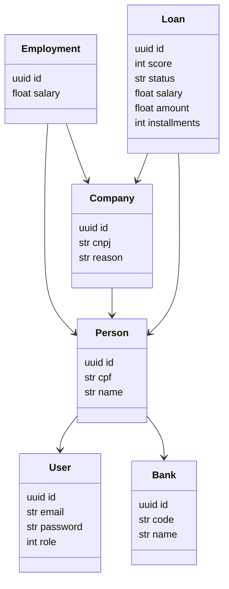

# Auto Credito

Mini sistema que avialia e concede crédito consigniado de forma automática

## Como rodar a aplicação

### API

Dentro da pasta `auto-credit-api`

- Criar um arquivo de nome `.env` coma as configurações de acesso ao banco (Postegres) no seguinte formato

```sh
DB_HOST=<HOST>
DB_PORT=<PORT>
DB_USERNAME=<USERNAME>
DB_PASSWORD=<PASSWORD>
DB_NAME=<SCHEMA>
```

- Executar o comando
  `npm start`

### Interface

## Dependências

- API
  - NestJS: Framework
  - Swagger: Documentação

## Entendendo o problema

A ideia deste projeto é desenvolver uma aplicação onde o cliente possa solicitar um empréstimo de forma ágil, economizando tempo e recursos tanto do tomador quanto do concessor do crédito. Para isso o cliente poderá acessar o sistema e fazer a solicitação do crédito pretendido e se este atender a todos os requisitos necessários lhe será concedida a quantia solocitada de forma automática e simplificada.
Os requisitos são:

- O cliente estar vinculada a uma empresa conveniada à concessora.
- O valor solicitado não exceder a 35% do salário
- O cliente ter score mínimo suficiente para o valor

### Agentes

- Concessora: resposável por avaliar e conceder o crédito solicitado
- Cliente: solicitante, deve estar vinculado a empresa parceira e ter score válido
- Empresa: garantidora, deve estar associada a concessora
- Banco: financeiro, responsável pelas tranferências de valores
- Agência de risco: avaliador, responsável por emitir um score ao solicittante

### Entidades e relacionamentos


